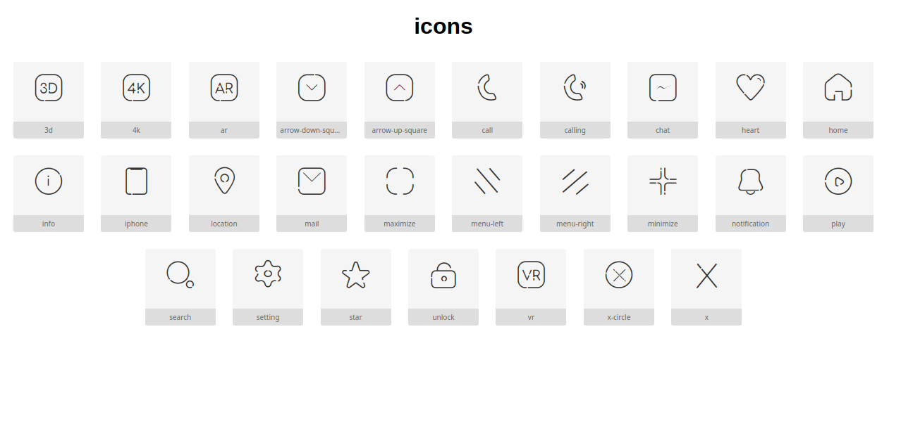

### Preview



### usage 

**if you want to use it as a font icon :**

0 - Download or Clone Repository

```bash
git clone https://github.com/rinaz-technology/rinaz-icons
```

1- copy `icons.woff2`, `icons.woff`,  `icons.eot`, `icons.css`  in your `css` folder for example

2 - link `icons.css` in your `HTML` file 

```bash
<link rel="stylesheet" type="text/css" href="css/icons.css" />
```


3 - use it 

```bash
<i class="ri ri-3d"></i>
```